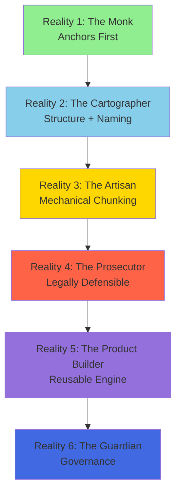
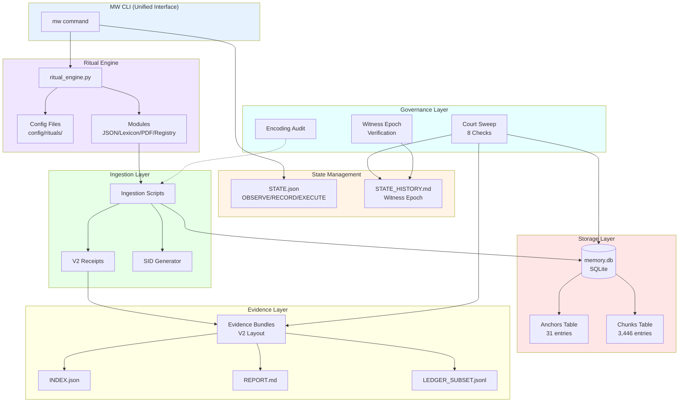
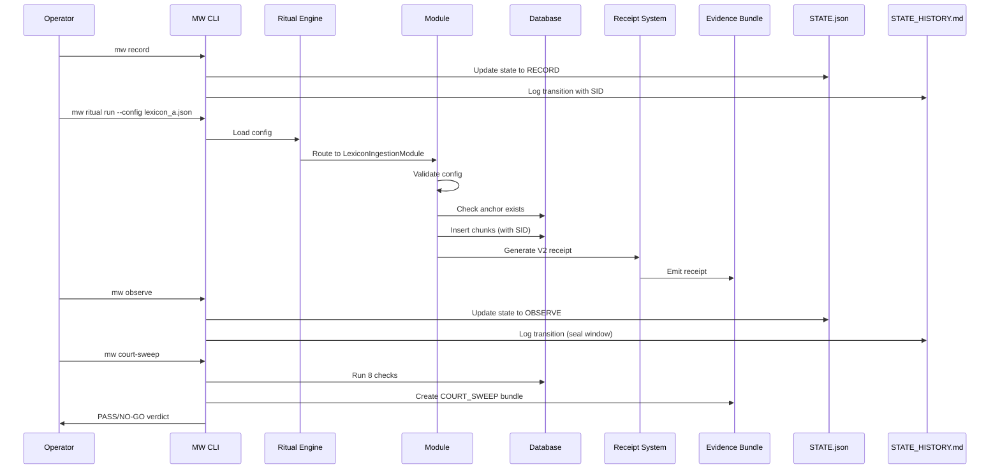

# Solobic Wrapper Ark V0 ? Architecture Overview

**Version**: 0.1.0  
**Last Updated**: 2025-12-29

---

## Table of Contents
1. [System Overview](#system-overview)
2. [The 6 Realities Framework](#the-6-realities-framework)
3. [Architecture Diagram](#architecture-diagram)
4. [Component Breakdown](#component-breakdown)
5. [Data Flow](#data-flow)
6. [Security Model](#security-model)
7. [Antifragility Principles](#antifragility-principles)

---

## System Overview

**Solobic Wrapper Ark** (SWA) is a witness-first, prosecutor-grade knowledge ingestion and storage system designed for epistemic discipline and legal defensibility.

### Core Tenets
- **Mechanical chunking only**: No embeddings, no semantic remixing
- **Witness-first**: Every operation tracked with session IDs (SIDs)
- **Prosecutor-grade**: Full chain of custody with V2 receipts
- **Antifragile**: System strengthens from errors and audits
- **Config-driven**: Reusable ritual engine for portability

### Design Philosophy
> "The realities are not destinations. They are states of being."

Each reality builds on the previous, creating a foundation of trust and auditability. You cannot skip realities?each one must be satisfied before moving to the next.

---

## The 6 Realities Framework



### Reality 1: The Monk (Anchors First)
**Purpose**: Establish canonical anchor registry before any content ingestion

**Components**:
- Anchor registry (31 anchors)
- Database schema (SQLite)
- Validation rules

**Key Scripts**:
- `scripts/register_anchors_from_registry.py`

### Reality 2: The Cartographer (Structure + Naming Discipline)
**Purpose**: Enforce clean naming and structural invariants

**Components**:
- Script State Registry (54 scripts: FROZEN/STABLE/REPAIR/OBSERVE/HOLSTERED)
- Naming conventions (chunk_id patterns, folder rules)
- Path validation

**Key Tools**:
- `tools/script_state_check.py`
- `docs/SCRIPT_STATE_REGISTRY.yml`

### Reality 3: The Artisan (Mechanical Chunking)
**Purpose**: Deterministic, mechanical chunking only

**Components**:
- Lexicon ingestion (2,839 chunks)
- PDF page chunking (607 pages from Book of Solobility)
- Collision-proof chunk IDs
- SHA256 manifest verification

**Key Scripts**:
- `scripts/import_lexicon_chunks_v1_1.py`
- `scripts/chunk_bos_pages_pilot.py`

### Reality 4: The Prosecutor (Legally Defensible)
**Purpose**: Every batch becomes legally defensible evidence

**Components**:
- Receipt Schema V2
- Evidence Bundle Layout V2
- Audit trail verification
- Orphan detection
- Strict failure rules

**Key Scripts**:
- `scripts/validate_receipt_v2.py`
- `scripts/audit_ingestion_trail.py`
- `scripts/prosecutor_emit_evidence_bundle.py`

### Reality 5: The Product Builder (Reusable Ritual Engine)
**Purpose**: Transform one-off scripts into reusable patterns

**Components**:
- Ritual engine framework
- Config-driven modules (JSON, Lexicon, PDF, Registry)
- Base module abstraction
- MW CLI integration

**Key Components**:
- `scripts/ritual_engine.py`
- `modules/base_module.py`
- `modules/json_ingestion.py`
- `modules/lexicon_ingestion.py`
- `modules/pdf_ingestion.py`
- `modules/registry_ingestion.py`

### Reality 6: The Guardian (Governance + Antifragility)
**Purpose**: Prevent regression, enforce immutability

**Components**:
- Court Sweep (8 checks)
- Witness epoch tracking
- Encoding hygiene
- State transition discipline
- Bundle layout validation

**Key Tools**:
- `tools/court_sweep.py`
- `tools/verify_witness_epoch.py`
- `tools/encoding_audit.py`

---

## Architecture Diagram



---

## Component Breakdown

### Database Layer

**Technology**: SQLite  
**File**: `data/memory.db`

**Schema**:
- **anchors**: Primary content sources (31 entries)
  - `anchor_id` (TEXT PRIMARY KEY)
  - `anchor_type` (TEXT)
  - `canonical_path` (TEXT)
  - `registered_utc` (TEXT)
  - `metadata_json` (TEXT)

- **chunks**: Atomic content units (3,446 entries)
  - `chunk_id` (TEXT PRIMARY KEY)
  - `anchor_id` (TEXT FOREIGN KEY)
  - `chunk_type` (TEXT)
  - `locator` (TEXT)
  - `content_text` (TEXT)
  - `import_session_id` (TEXT)
  - `indexed_utc` (TEXT)

### Receipt System (V2 Specification)

**Purpose**: Prosecutor-grade chain of custody

**Schema**:
```json
{
  "receipt_id": "RECEIPT_<OPERATION>_<ANCHOR>_<TIMESTAMP>",
  "operation_type": "CHUNKS_INGESTION",
  "ts_utc": "2025-12-29T05:38:16Z",
  "session_id": "S_20251225T075155Z_STATE_RECORD",
  "strict_rules": {
    "chunk_collision": "STOP",
    "missing_anchor": "STOP"
  },
  "db_state": {
    "before": {"chunks_count": 2839},
    "after": {"chunks_count": 3446},
    "delta": {"chunks_added": 607}
  },
  "artifacts": ["manifest_sha256"],
  "integrity": {
    "manifest_sha256": "ec86c62..."
  }
}
```

**Key Fields**:
- `receipt_id`: Unique identifier
- `session_id`: Witness SID
- `strict_rules`: Enforced constraints
- `db_state`: Before/after/delta tracking
- `integrity`: SHA256 hashes

### Evidence Bundle Layout (V2)

**Structure**:
```
S_<TIMESTAMP>_<DESCRIPTOR>/
??? INDEX.json          # Bundle metadata
??? REPORT.md           # Human-readable summary
??? RECEIPTS/           # All operation receipts
?   ??? RECEIPT_*.json
??? LEDGER_SUBSET.jsonl # Relevant ledger entries
??? MANIFESTS/          # File manifests
    ??? *.manifest.json
```

**INDEX.json Schema**:
```json
{
  "type": "evidence_bundle",
  "bundle_version": "V2",
  "ts_utc": "20251229T053816Z",
  "mode": "OBSERVE",
  "descriptor": "COURT_SWEEP"
}
```

### Ritual Engine

**Purpose**: Config-driven, reusable ingestion patterns

**Architecture**:
```
RitualEngine
??? Config Loader (JSON Schema validation)
??? Module Router (type -> module mapping)
??? BaseIngestionModule (abstract)
?   ??? validate_config()
?   ??? execute()
?   ??? generate_receipt()
??? Concrete Modules
    ??? JSONIngestionModule
    ??? LexiconIngestionModule
    ??? PDFIngestionModule
    ??? RegistryIngestionModule
```

**Workflow**:
1. Load config from `config/rituals/*.json`
2. Validate against schema
3. Route to appropriate module
4. Execute with dry-run support
5. Generate V2 receipt
6. Emit evidence bundle

### CLI Interface (MW Tool)

**Commands**:
- `mw state` ? Show current state
- `mw observe` ? Transition to OBSERVE
- `mw record` ? Transition to RECORD
- `mw run --intent "..." --script <path>` ? Execute recorded command
- `mw court-sweep` ? Run full audit
- `mw ritual list` ? Show available rituals
- `mw ritual run --config <path>` ? Execute ritual
- `mw ritual validate --config <path>` ? Dry-run validation
- `mw lint bundles` ? Verify witness epoch compliance
- `mw lint scripts` ? Check script state registry

### Court Sweep (8 Checks)

| Check | Purpose | Pass Criteria |
|-------|---------|---------------|
| `db_counts` | Database integrity | Counts match expectations |
| `state_history_witness` | SID compliance | 0 violations post-epoch |
| `evidence_index` | Index validity | INDEX.json exists and valid |
| `bundle_uniformity` | Bundle completeness | All required files present |
| `encoding_reports_present` | Encoding hygiene | Reports exist |
| `receipt_validation` | Receipt schema | 100% valid receipts |
| `orphan_chunks` | Chain of custody | 0 chunks without SID |
| `bundle_layout` | V2 compliance | All bundles V2 format |

**Output**: Evidence bundle with PASS/NO-GO verdict

---

## Data Flow



---

## Security Model

### Witness Epoch
**Epoch Start**: 2025-12-25T07:51:59Z

**Policy**:
1. All post-epoch state transitions **must** include canonical SID
2. SID generated during transition to RECORD
3. Same SID logged during transition back to OBSERVE (seals window)
4. Pre-epoch transitions documented in legacy addendum

**Verification**: `tools/verify_witness_epoch.py`

### Session ID (SID) Format
```
S_<UTC_TIMESTAMP>_<DESCRIPTOR>
```

**Example**: `S_20251225T075155Z_STATE_RECORD`

**Properties**:
- Globally unique
- Sortable chronologically
- Human-readable
- Tamper-evident (appears in receipts, bundles, state history)

### Cryptographic Verification

**SHA256 Stamping**:
- Script State Registry: FROZEN/STABLE scripts have SHA256 hashes
- Receipts: Manifests include SHA256 of source files
- Evidence Bundles: INDEX.json includes bundle SHA256

**Integrity Checks**:
- `tools/script_state_check.py` ? Detect modified scripts
- `scripts/validate_receipt_v2.py` ? Verify receipt integrity
- `tools/court_sweep.py` ? Comprehensive audit

---

## Antifragility Principles

### STGRAIL Framework

**S**tate discipline  
- OBSERVE (read-only) / RECORD (write with tracking) / EXECUTE (one-off) / REPAIR (fix)
- `STATE.json` + `STATE_HISTORY.md`

**T**imestamps  
- Local Kingston time (-05:00) + UTC (Z)
- Synchronized in receipts, bundles, state history

**G**overnance  
- Script State Registry (54 scripts)
- Court Sweep (8 checks)
- SHA256 verification

**R**eceipts  
- V2 schema with strict rules
- Before/after/delta tracking
- Artifact references

**A**uditability  
- Evidence bundles
- Receipt chains
- Witness epoch

**I**ntegrity  
- SHA256 hashing
- Collision detection
- Orphan prevention

**L**edger  
- LEDGER_SUBSET.jsonl in bundles
- Transaction history
- Append-only discipline

### Error Recovery

**Principle**: Fail fast and loud

**Strict Rules**:
- `chunk_collision=STOP` ? Never overwrite existing chunks
- `missing_anchor=STOP` ? Never ingest orphan chunks
- `manifest_sha_mismatch=STOP` ? Never proceed with corrupted source

**Recovery Paths**:
1. **From Receipts**: Replay ingestion using receipt metadata
2. **From Evidence Bundles**: Reconstruct state from bundle artifacts
3. **From State History**: Understand transition sequence
4. **From Database Backup**: Restore known-good state

---

## Technology Stack

- **Language**: Python 3.9+
- **Database**: SQLite 3
- **CLI**: argparse + custom routing
- **Config**: JSON with JSON Schema validation
- **Documentation**: Markdown + Mermaid diagrams
- **IDE**: VSCode (UTF-8 enforced)
- **Version Control**: Git-compatible (receipts, bundles)

---

## Directory Structure

```
solob-wrapper/
??? config/
?   ??? rituals/               # Ritual engine configs
?   ??? schemas/               # JSON schemas
??? core/
?   ??? chain_constitution.py  # Constitutional functions (FROZEN)
??? data/
?   ??? memory.db              # SQLite database
??? docs/
?   ??? RELEASE_NOTES_V0.md
?   ??? V0_ARCHITECTURE.md
?   ??? INSTALLATION.md
?   ??? QUICK_START.md
?   ??? OPERATORS_GUIDE.md
?   ??? FEATURES_V0.md
?   ??? EVIDENCE_V0.md
?   ??? RECEIPT_SCHEMA_V2.md
?   ??? EVIDENCE_BUNDLE_LAYOUT.md
?   ??? STATE_HISTORY_FORMAT_SPEC.md
?   ??? IMPLEMENTATION_DELTA.md
?   ??? STATE.json
?   ??? STATE_HISTORY.md
??? evidence/
?   ??? bundles/               # Evidence bundles (V2)
?   ??? audits/                # Audit reports
??? modules/                   # Ritual engine modules
?   ??? base_module.py
?   ??? json_ingestion.py
?   ??? lexicon_ingestion.py
?   ??? pdf_ingestion.py
?   ??? registry_ingestion.py
??? scripts/                   # Ingestion & utility scripts
?   ??? ritual_engine.py
?   ??? import_lexicon_chunks_v1_1.py
?   ??? chunk_bos_pages_pilot.py
?   ??? register_anchors_from_registry.py
?   ??? validate_receipt_v2.py
?   ??? log_state_transition.py
?   ??? log_changelog.py
?   ??? ...
??? tools/                     # Audit & governance tools
?   ??? cli/
?   ?   ??? mw.py             # Unified CLI
?   ??? court_sweep.py
?   ??? verify_witness_epoch.py
?   ??? script_state_check.py
?   ??? ...
??? CHANGELOG.MD
```

---

## Next Steps

- **Get Started**: See [QUICK_START.md](QUICK_START.md)
- **Install**: See [INSTALLATION.md](INSTALLATION.md)
- **Operate**: See [OPERATORS_GUIDE.md](OPERATORS_GUIDE.md)
- **Extend**: See ritual engine documentation

---

**Solobic Wrapper Ark V0** ? Architecture designed for truth under replay

---

END OF ARCHITECTURE OVERVIEW
